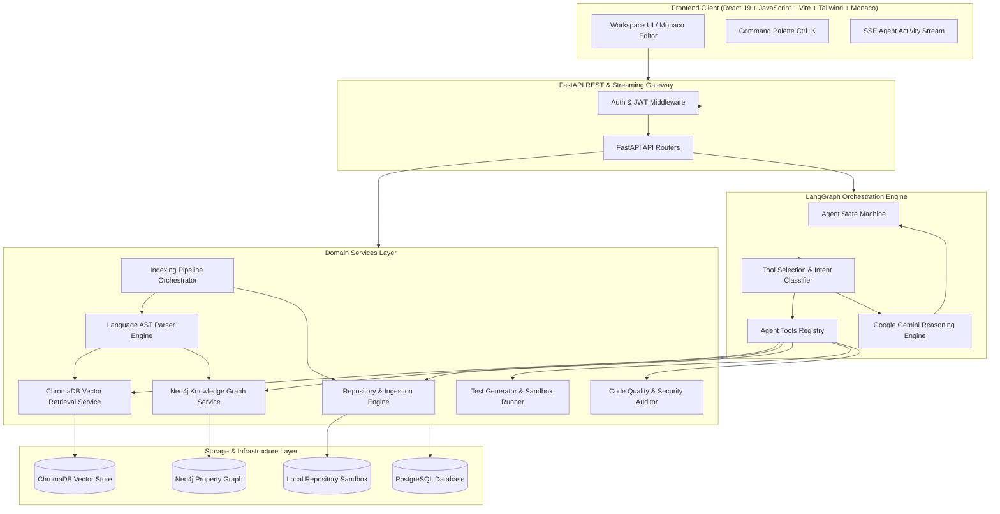

# Canopy AI — AI Codebase Assistant
### Agentic AI & RAG Software Engineering System

[](https://www.python.org/)
[](https://fastapi.tiangolo.com/)
[](https://react.dev/)
[](https://developer.mozilla.org/en-US/docs/Web/JavaScript)
[](https://langchain.com/)
[](https://www.trychroma.com/)
[](https://neo4j.com/)
[](https://www.docker.com/)

> **Canopy AI** is an enterprise-grade developer platform designed for deep codebase intelligence, semantic exploration, dependency topology mapping, and autonomous problem-solving. Grounded directly in repository AST symbols, vector embeddings, and Neo4j property graphs.

---

## 📌 Resume Highlights & Elevator Pitch

* **Architected an Autonomous Codebase Assistant:** Engineered a multi-step reactive agent using **LangGraph** and **Google Gemini** that reasons over entire repositories, selecting tools dynamically to search AST symbols, trace call graphs, and synthesize verified code explanations.
* **Dual-Engine Retrieval (RAG + Knowledge Graph):** Built a semantic code retrieval pipeline utilizing **ChromaDB** with dense Gemini embeddings paired with a **Neo4j** property graph to model `[:IMPORTS]`, `[:CALLS]`, `[:DEFINES]`, and calculate blast-radius change impacts.
* **Full-Stack Developer IDE Workflow:** Built a modern desktop-first IDE interface using **React 19**, **JavaScript / JSX**, **Monaco Editor**, **Tailwind CSS**, and **FastAPI**, featuring live SSE agent streaming, automated Pytest suite synthesis, and static security auditing.

---

## 🏗️ High-Level System Architecture



---

## 🚀 Key Capabilities

1. **Multi-Source Repository Ingestion:** Connect remote GitHub repositories, upload ZIP codebase archives (with path-traversal and zip-bomb safety guards), or evaluate with 1-click **Bundled Demo Microservice**.
2. **Language-Aware AST Parsing & Semantic Chunking:** Slices source code strictly at function, method, class, and module docstring boundaries, preserving line coordinates (`start_line`, `end_line`) rather than arbitrary token splits.
3. **ChromaDB Vector Store & Hybrid Search:** Indexes dense vector embeddings with metadata filters (`file_path`, `symbol_name`, `chunk_type`) with reciprocal rank fusion matching.
4. **Neo4j Property Graph & Blast Radius Analysis:** Discovers upstream callers, downstream dependencies, and evaluates the change impact risk of modifying any function or class.
5. **Streaming Agent Activity UI:** Emits safe, high-level LangGraph progress tokens over Server-Sent Events (`✓ Searched vector embeddings`, `✓ Queried call graph in Neo4j`, `● Generating structured answer`).
6. **Integrated Code Workspace:** Full VS Code / Cursor aesthetic with file tree, **Monaco Editor** syntax highlighting, contextual code actions ("Explain", "Find usages", "Audit", "Generate tests"), and verified clickable citations.
7. **Automated Pytest Suite Synthesis & Runner:** Generates and executes Pytest test cases with real-time stdout/stderr log inspection.

---

## 🛠️ Technology Stack

| Layer | Technologies |
| :--- | :--- |
| **Frontend** | React 19, JavaScript (ES6+ / JSX), Vite, Tailwind CSS, Monaco Editor, Lucide Icons, TanStack Query |
| **Backend** | Python 3.11+, FastAPI, SQLAlchemy, Pydantic v2, Uvicorn, Pytest |
| **Agentic AI** | LangGraph, LangChain, Google Gemini API (1.5 Pro / Flash) |
| **RAG & Vectors** | ChromaDB, Gemini `text-embedding-004`, Semantic Code Chunker |
| **Knowledge Graph** | Neo4j 5 Community, Cypher Query Engine |
| **Database** | PostgreSQL 15, SQLite (dev fallback) |
| **Infrastructure** | Docker, Docker Compose, Nginx |

---

## 💻 Local Setup & Quick Start

### Prerequisites
* Python 3.11+
* Node.js 18+ and npm
* Git

### 1. Clone & Configure Environment
```bash
git clone https://github.com/username/ai-codebase-assistant.git
cd ai-codebase-assistant

# Copy environment variables template
cp .env.example .env
```

### 2. Run Backend
```bash
cd backend
python -m pip install -r requirements.txt
python -m uvicorn app.main:app --reload --port 8000
```
* Backend API Documentation: `http://localhost:8000/docs`
* Health Check: `http://localhost:8000/health`

### 3. Run Frontend
```bash
cd ../frontend
npm install
npm run dev
```
* Frontend Application: `http://localhost:5173`
* Default Demo Account: `demo@codemind.ai` / `password123` (or click **1-Click Demo**)

---

## 🐳 Dockerized Deployment

Run the complete multi-container stack (Frontend, Backend, PostgreSQL, ChromaDB, Neo4j) with a single command:

```bash
docker-compose up --build -d
```

### Service Map
* **Frontend Web App:** `http://localhost:5173`
* **FastAPI Backend API:** `http://localhost:8000`
* **Neo4j Browser Dashboard:** `http://localhost:7474`
* **ChromaDB Endpoint:** `http://localhost:8001`
* **PostgreSQL:** `localhost:5432`

---

## 🧪 Testing Suite

Execute the integration and unit test suite via Pytest:

```bash
cd backend
python -m pytest tests/test_api.py -v
```

Tests cover:
* Authentication & JWT token issuance/refresh
* Idempotent repository ingestion & AST symbol indexing
* ChromaDB vector similarity search
* Neo4j knowledge graph topology & blast radius analysis
* Static AST security & complexity audit engine
* Pytest test execution inside sandbox runner

---

## 📄 License
MIT License. Built for software engineering demonstration and technical interview presentations.
